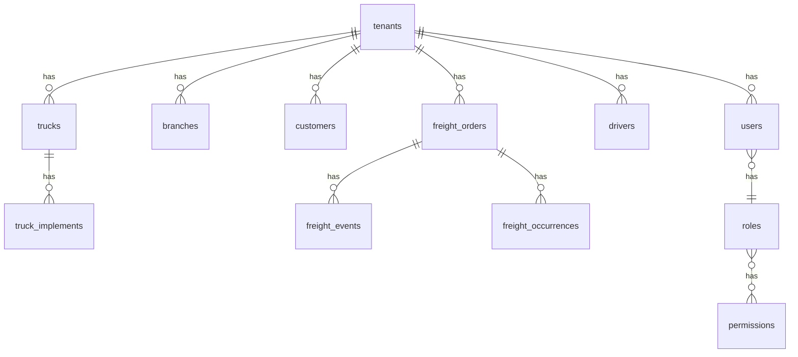

# TM Transportadora — Contrato de API v1

Documento de referência para implementação do backend **FastAPI** no repositório `TM-TRANSPORTADORA-API`.

## Convenções gerais

| Item | Valor |
|------|--------|
| Base URL | `{API_URL}/api/v1` |
| Autenticação | `Authorization: Bearer {access_token}` |
| Multi-tenant | Header obrigatório: `X-Tenant-Id: {uuid}` |
| Filial (opcional) | `X-Branch-Id: {uuid}` |
| Paginação | Query `page` (1-based), `page_size` (default 20, max 100) |
| Ordenação | `sort_by`, `sort_order=asc\|desc` |
| Erros | FastAPI `detail` (string ou array de validação) |
| OpenAPI | `/docs`, `/redoc` — espelho deste contrato |
| Soft delete | Campo `deleted_at` em entidades principais |
| Auditoria | Toda mutação crítica → `audit_logs` |

### Resposta paginada

```json
{
  "items": [],
  "total": 0,
  "page": 1,
  "page_size": 20,
  "pages": 0
}
```

---

## Autenticação (`/auth`)

### `POST /auth/register-tenant`

Cria tenant + usuário admin inicial.

**Body:**
```json
{
  "tenant_name": "Transportadora XYZ",
  "document": "12.345.678/0001-90",
  "admin_name": "João Admin",
  "email": "admin@xyz.com",
  "password": "senhaSegura123"
}
```

**Response 201:**
```json
{
  "tokens": { "access_token": "...", "refresh_token": "...", "token_type": "bearer" },
  "user": { "id": "uuid", "email": "...", "name": "...", "role": "admin", "tenant_id": "uuid", "permissions": [] }
}
```

**RBAC:** público  
**Auditoria:** `tenant.created`, `user.created`

---

### `POST /auth/login`

**Body:** `{ "email": "string", "password": "string" }`  
**Response 200:** igual register (tokens + user)  
**JWT claims:** `sub`, `tenant_id`, `role`, `permissions[]`, `branch_id?`, `exp`

---

### `POST /auth/refresh`

**Body:** `{ "refresh_token": "string" }`  
**Response 200:** `{ "access_token", "refresh_token", "token_type" }`

---

### `GET /auth/me`

**Response 200:** `AuthUser`  
**RBAC:** autenticado

---

## Filiais (`/branches`)

### `GET /branches`

Lista filiais do tenant.  
**RBAC:** autenticado

---

## Clientes (`/customers`)

### `GET /customers`

**RBAC:** `freight:read` ou superior

### `POST /customers`

**Body:** `{ "name", "document?", "email?", "phone?" }`  
**RBAC:** `freight:write`

---

## Frota (`/fleet`)

### `GET /fleet/trucks`

Query: `status?`, `branch_id?`, `page`, `page_size`  
**RBAC:** `fleet:read`

### `POST /fleet/trucks`

**Body:**
```json
{
  "plate": "ABC1D23",
  "renavam": "optional",
  "brand": "Volvo",
  "model": "FH 540",
  "year": 2022,
  "type": "cavalo",
  "capacity_kg": 45000,
  "avg_consumption_km_l": 2.1,
  "status": "ativo",
  "mileage_km": 0,
  "branch_id": "uuid",
  "insurance_expires_at": "2026-12-01",
  "license_expires_at": "2026-08-15"
}
```

**RBAC:** `fleet:write`  
**Auditoria:** `truck.created`

### `GET /fleet/trucks/{id}`

### `PATCH /fleet/trucks/{id}`

### `DELETE /fleet/trucks/{id}`

Soft delete. **RBAC:** `fleet:write`

### `GET /fleet/trucks/{id}/implements`

### `POST /fleet/trucks/{id}/implements`

**Body:** `{ "type": "carreta|bau|tanque|prancha", "identifier": "string", "capacity_kg?": number }`

---

## Motoristas (`/drivers`)

### `GET /drivers`

Query: `status?`, `page`, `page_size`  
**RBAC:** `drivers:read`

### `POST /drivers`

**Body:**
```json
{
  "name": "string",
  "cpf": "optional",
  "cnh_number": "string",
  "cnh_category": "E",
  "cnh_expires_at": "2027-05-20",
  "status": "disponivel",
  "phone": "optional",
  "commission_pct": 8
}
```

### `GET /drivers/{id}` | `PATCH /drivers/{id}` | `DELETE /drivers/{id}`

### `POST /drivers/{id}/signature`

**Body:** `{ "image_base64": "data:image/png;base64,..." }`

---

## Fretes (`/freight`)

### `GET /freight/orders`

Query: `status?`, `customer_id?`, `branch_id?`, `period_from?`, `period_to?`  
**RBAC:** `freight:read`

### `POST /freight/orders`

**Body:**
```json
{
  "customer_id": "uuid",
  "branch_id": "uuid",
  "origin_city": "string",
  "origin_state": "SP",
  "destination_city": "string",
  "destination_state": "SP",
  "cargo_description": "string",
  "weight_kg": 28000,
  "value_brl": 18500,
  "freight_type": "carga_geral",
  "deadline_at": "2026-05-25",
  "truck_id": "optional",
  "driver_id": "optional"
}
```

Status inicial: `cotacao`. Gera `code` sequencial por tenant.

### `GET /freight/orders/{id}`

### `PATCH /freight/orders/{id}`

### `POST /freight/orders/{id}/advance-status`

Avança para próximo status do fluxo:  
`cotacao → aprovacao → embarque → em_transito → entregue → finalizado`

**RBAC:** `freight:status`

### `PATCH /freight/orders/{id}/status`

**Body:** `{ "status": "cancelado" }` — transições validadas na máquina de estados.

### `GET /freight/orders/{id}/events`

Timeline de eventos.

### `POST /freight/orders/{id}/occurrences`

**Body:** `{ "type": "atraso|avaria|documentacao", "description": "string" }`

### `PATCH /freight/orders/{id}/checklist`

**Body:** `{ "items": { "carga_ok": true, "lacre_ok": true } }`

---

## Dashboard (`/dashboard`)

### `GET /dashboard/kpis`

Query: `period_from`, `period_to`, `branch_id`, `customer_id`  
**Response:**
```json
{
  "freights_in_progress": 3,
  "active_trucks": 12,
  "available_drivers": 8,
  "monthly_revenue_brl": 284500.0,
  "operational_costs_brl": 198200.0,
  "maintenance_alerts": 2,
  "financial_pending": 5
}
```

### `GET /dashboard/freights-by-status`

### `GET /dashboard/revenue-series?days=30`

### `GET /dashboard/export/pdf` | `GET /dashboard/export/excel`

Query: mesmos filtros do KPI. **RBAC:** `dashboard:read`

---

## Uploads (`/uploads`)

### `POST /uploads/presign`

**Body:** `{ "filename": "doc.pdf", "content_type": "application/pdf", "context": "freight_proof|driver_doc|truck_doc" }`  
**Response:** `{ "upload_url", "file_key", "expires_in" }`  
Storage: S3 compatível.

---

## Rastreamento (`/tracking`) — fase 2

### `GET /tracking/map`

Posições atuais dos veículos em viagem.

### `GET /tracking/trucks/{id}/history`

Histórico de rota, tempo parado, cercas virtuais.

---

## Auditoria (`/audit`)

### `GET /audit/logs`

Query: `entity_type?`, `entity_id?`, `user_id?`, `from?`, `to?`  
**RBAC:** `tenant:admin`

---

## Health

### `GET /healthz`

`{ "status": "ok", "db": "ok", "redis": "ok" }`

---

## Modelagem de banco (PostgreSQL)



### Tabelas principais

| Tabela | Campos chave | Índices |
|--------|--------------|---------|
| `tenants` | id, slug, name, document, created_at | UNIQUE(slug) |
| `users` | id, tenant_id, email, password_hash, role, branch_id | UNIQUE(tenant_id, email) |
| `branches` | id, tenant_id, name, city, state | (tenant_id) |
| `trucks` | id, tenant_id, plate, status, mileage_km, deleted_at | UNIQUE(tenant_id, plate), (tenant_id, status) |
| `drivers` | id, tenant_id, cnh_number, status, deleted_at | (tenant_id, status) |
| `customers` | id, tenant_id, name | (tenant_id) |
| `freight_orders` | id, tenant_id, code, status, customer_id, deleted_at | (tenant_id, status), (tenant_id, code) |
| `freight_events` | id, freight_id, status, created_at | (freight_id) |
| `audit_logs` | id, tenant_id, user_id, action, entity_type, entity_id, payload, created_at | (tenant_id, created_at) |

### RBAC — perfis

| Role | Permissions |
|------|-------------|
| admin | `*` |
| operacional | fleet/drivers/freight CRUD + status |
| financeiro | dashboard + finance read |
| motorista | freight read + status update |
| cliente | freight read (own customer) |

---

## Segurança esperada no backend

- Rate limit: 100 req/min por IP (login: 10/min)
- Bcrypt/Argon2 para senhas
- Refresh token rotation + blacklist Redis
- Tenant middleware: validar `X-Tenant-Id` == JWT claim
- LGPD: endpoints de export/delete de dados do titular (fase 2)
- Logs estruturados (JSON) com `tenant_id`, `user_id`, `request_id`

---

## Jobs (Celery + Redis)

| Task | Trigger |
|------|---------|
| `notify.document_expiring` | CRON diário |
| `notify.freight_delayed` | status + SLA |
| `report.generate_pdf` | export dashboard |
| `ocr.document` | upload CT-e (fase 5) |

---

## Variáveis de ambiente (backend)

```
DATABASE_URL=postgresql+asyncpg://...
REDIS_URL=redis://...
JWT_SECRET=...
JWT_ACCESS_TTL_MIN=30
JWT_REFRESH_TTL_DAYS=7
S3_ENDPOINT=...
S3_BUCKET=...
S3_ACCESS_KEY=...
S3_SECRET_KEY=...
```

---

## Alinhamento com o front

O front em `TM-TRANSPORTADORA-FRONT` consome estes endpoints via `lib/api/services/*`.  
Com `NEXT_PUBLIC_API_URL` vazio e `NEXT_PUBLIC_USE_MOCKS=true`, usa `lib/mocks/handlers.ts`.

Última atualização: MVP v1 — Dashboard, Frota, Motoristas, Fretes.
