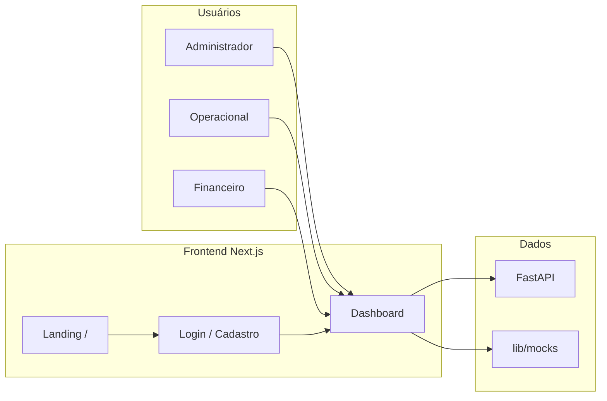
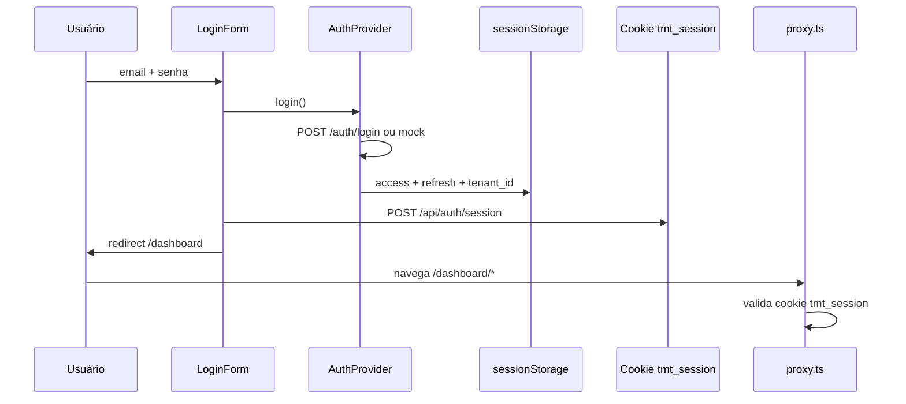
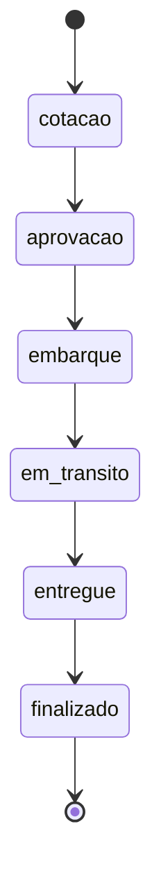
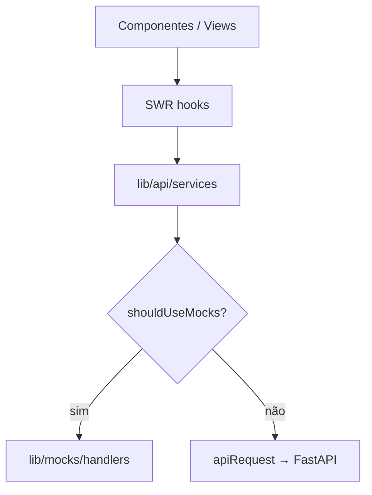

# Fluxo da aplicação — TM Transportadora

Documento de referência para onboarding técnico e operacional do frontend SaaS.

## Visão geral

A aplicação é um **painel web multi-tenant** para transportadoras gerirem frota, motoristas e fretes. O frontend (este repositório) comunica-se com uma API FastAPI separada (`TM-TRANSPORTADORA-API`) ou opera em **modo demonstração** com dados mock locais.



---

## Jornada do usuário

### 1. Acesso público

| Rota | Descrição |
|------|-----------|
| `/` | Landing com proposta de valor e CTAs para login/cadastro |
| `/login` | Autenticação |
| `/cadastro` | Onboarding de nova transportadora (tenant) |
| `/termos` · `/privacidade` | LGPD |

### 2. Autenticação e sessão



**Persistência:**

- `sessionStorage`: tokens JWT e `tenant_id` / `branch_id` (chamadas API no browser).
- Cookie `httpOnly` `tmt_session`: gate do `proxy.ts` nas rotas `/dashboard`.

**Logout:** limpa `sessionStorage` + `DELETE /api/auth/session`.

### 3. Painel autenticado (`/dashboard`)

Layout fixo: **sidebar** (módulos) + **header** (filial, tema, usuário, Ctrl+K).

| Módulo | Rota base | Perfis com acesso |
|--------|-----------|-------------------|
| Dashboard | `/dashboard` | admin, operacional, financeiro |
| Fretes | `/dashboard/fretes` | admin, operacional |
| Frota | `/dashboard/frota` | admin, operacional |
| Motoristas | `/dashboard/motoristas` | admin, operacional |
| Financeiro, etc. | — | badge **Em breve** (fase 2) |

**Seletor de filial:** `TenantProvider` carrega filiais via API e filtra contexto operacional (`X-Branch-Id` nas requisições reais).

---

## Fluxo operacional de fretes (core)

Estados da ordem de frete (máquina de estados):



| Etapa | Ação no sistema |
|-------|-----------------|
| Cotação | `POST` ordem; status inicial `cotacao` |
| Aprovação → … | Botão **Avançar status** ou `PATCH` status |
| Timeline | Eventos automáticos a cada transição |
| Ocorrências | Registro manual (atraso, avaria, documentação) |
| Entrega | Aba checklist + comprovantes (upload via presign — API) |

**Telas:**

1. **Lista** — `/dashboard/fretes`
2. **Nova ordem** — `/dashboard/fretes/novo`
3. **Detalhe** — `/dashboard/fretes/[id]` (tabs: timeline, ocorrências, comprovantes, checklist)

---

## Camada de dados no frontend



| Variável | Comportamento |
|----------|----------------|
| `NEXT_PUBLIC_API_URL` vazio + `USE_MOCKS=true` | Mock in-memory (`lib/mocks/store.ts`) |
| `NEXT_PUBLIC_API_URL` definido | HTTP real com Bearer + `X-Tenant-Id` |

Contrato completo dos endpoints: [BACKEND_API.md](./BACKEND_API.md).

---

## Controle de acesso (RBAC)

Permissões definidas em `lib/rbac/permissions.ts`. O menu e ações de escrita respeitam o perfil do usuário logado.

| Perfil | Escopo MVP |
|--------|------------|
| `admin` | Acesso total |
| `operacional` | Dashboard + CRUD frota, motoristas, fretes |
| `financeiro` | Dashboard (leitura) |
| `motorista` · `cliente` | Fase 2 (portal / app) |

---

## Modo desenvolvimento vs produção

| Ambiente | Configuração |
|----------|----------------|
| **Dev local** | `.env.local` com `NEXT_PUBLIC_USE_MOCKS=true`; credenciais demo no README |
| **Staging / Prod** | `NEXT_PUBLIC_USE_MOCKS=false`; `NEXT_PUBLIC_API_URL` apontando para API; deploy Vercel |

---

## Estrutura de pastas (navegação mental)

```
app/                    → rotas (thin pages)
components/
  providers/            → Auth, Tenant, Theme
  layout/               → Sidebar, Header, Command Palette
  dashboard|fretes|frota|motoristas/  → views por domínio
lib/
  api/services/         → um arquivo por domínio de API
  mocks/                → seed + store + handlers
  rbac/                 → permissões
docs/                   → contratos e este fluxo
```

---

## Próximas integrações (roadmap)

1. Backend FastAPI conforme `BACKEND_API.md`
2. Upload S3 (comprovantes, CNH, fotos)
3. Rastreamento GPS no mapa do dashboard
4. Portal do cliente e app motorista
5. Módulos financeiro, abastecimento e manutenção

---

## Referências

- [README principal](../README.md)
- [Diretrizes UX](./UX_GUIDELINES.md)
- [ADR Multi-tenant](./ADR-001-multi-tenant.md)
